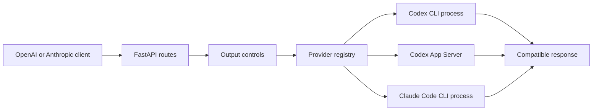
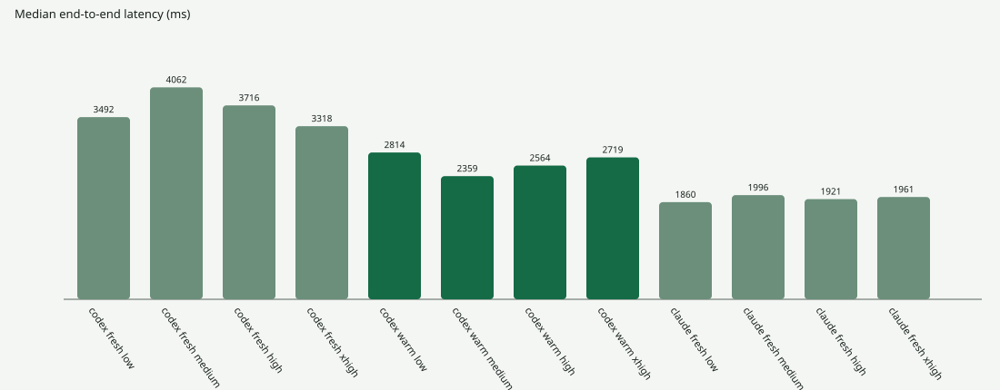

# Kessel

Kessel is a local HTTP compatibility layer for Codex and Claude Code
subscriptions. It exposes OpenAI-compatible Chat Completions endpoints and an
Anthropic-compatible Messages endpoint backed by the authenticated provider
CLIs installed on the same machine.

Kessel is designed for stateless, localhost-only operation. Each request uses
either a fresh provider process or, for warm Codex, a new ephemeral App Server
thread. Kessel does not resume provider conversations between requests.

## Capabilities

| Capability | Codex | Claude Code |
| --- | --- | --- |
| OpenAI Chat Completions | Supported | Supported |
| Anthropic Messages | Not applicable | Supported |
| Streaming responses | Supported | Supported |
| Fresh process backend | Default | Default |
| Warm stateless backend | Supported | Not supported |
| JSON Schema output | Supported | Supported |
| Required function call | One function | One function |
| Output-token ceiling | Approximate | Approximate |
| Stop sequences | Supported | Supported |
| Model discovery | Provider-reported | Confirmed models only |
| Subscription quota reporting | Full snapshot | Retry events only |

## Architecture



Provider-specific commands and response parsing are isolated in
`app/providers/`. Public routes preserve the response shape of the selected API
surface.

## Requirements

- Python 3.10 or later
- Codex CLI `0.155.1`, authenticated with `codex login`
- Claude Code `2.1.278`, authenticated with `claude auth login`

Kessel verifies both CLI versions during startup. Startup fails when a required
command is missing, its version cannot be parsed, or its version differs from
the tested version. Set `KESSEL_ENFORCE_CLI_VERSIONS=false` only when validating
a CLI upgrade.

## Installation

```powershell
git clone git@github.com:waderylan/kessel.git
cd kessel

python -m venv .venv
.venv\Scripts\Activate.ps1
python -m pip install -e ".[dev]"
```

Start the server on localhost:

```powershell
uvicorn app.main:app --host 127.0.0.1 --port 8000 --reload
```

The local web client is available at `http://127.0.0.1:8000`. OpenAPI
documentation is available at `http://127.0.0.1:8000/docs`.

## Authentication

Authentication is disabled when `KESSEL_API_KEY` is unset. When configured,
requests MUST provide the configured value using one of the following headers:

```http
Authorization: Bearer <key>
```

```http
X-API-Key: <key>
```

The Anthropic SDK sends `X-API-Key`. OpenAI clients normally send bearer
authentication.

## Endpoints

| Method | Path | Description |
| --- | --- | --- |
| `POST` | `/v1/codex/chat/completions` | OpenAI Chat Completions through Codex |
| `POST` | `/v1/claude/chat/completions` | OpenAI Chat Completions through Claude Code |
| `POST` | `/v1/messages` | Anthropic Messages through Claude Code |
| `GET` | `/v1/{provider}/models` | Provider model discovery |
| `GET` | `/health` | Process availability and tested CLI versions |

All responses include `X-Request-ID`. Responses from `/v1/messages` also
include the Anthropic-compatible `request-id` header.

## OpenAI Chat Completions

Configure an OpenAI client with a provider-specific base URL:

```python
from openai import OpenAI

client = OpenAI(
    base_url="http://127.0.0.1:8000/v1/codex",
    api_key="local",
)

response = client.chat.completions.create(
    model="default",
    messages=[
        {"role": "user", "content": "Explain this traceback and suggest a fix."}
    ],
    max_tokens=400,
)

print(response.choices[0].message.content)
```

Use `/v1/claude` as the base URL to route the same request through Claude Code.

### Request fields

| Field | Type | Default | Constraints |
| --- | --- | --- | --- |
| `model` | string | Required | Provider model ID or `default` |
| `messages` | array | Required | 1-100 messages |
| `stream` | boolean | `false` | Enables SSE output |
| `stream_options.include_usage` | boolean | `false` | Adds a terminal usage chunk |
| `reasoning_effort` | string | `low` | `low`, `medium`, `high`, or `xhigh` |
| `service_tier` | string | `default` | `default` or Codex-only `fast` |
| `backend` | string | `fresh` | `fresh` or Codex-only `warm` |
| `max_tokens` | positive integer | None | Approximate output-token ceiling |
| `max_completion_tokens` | positive integer | None | Alias for an output-token ceiling |
| `stop` | string or string array | None | Maximum four non-empty sequences |
| `response_format` | object | text | `text`, `json_object`, or `json_schema` |
| `tools` | array | Empty | Maximum one active function |
| `tool_choice` | string | `auto` | MUST be `required` when a tool is active |
| `n` | integer | `1` | Values other than `1` are rejected |

When both token-limit fields are present, Kessel applies the lower value.

The following message roles are accepted: `developer`, `system`, `user`,
`assistant`, and `tool`. String content and OpenAI text-part arrays are
supported.

### Streaming

Streaming responses use `text/event-stream` and OpenAI
`chat.completion.chunk` objects. The stream terminates with:

```text
data: [DONE]
```

Claude and warm Codex expose provider text deltas. Fresh Codex normally emits
the completed assistant message as one content chunk because `codex exec
--json` does not provide the same token-delta stream as App Server.

```python
stream = client.chat.completions.create(
    model="default",
    messages=[{"role": "user", "content": "Summarize this file."}],
    stream=True,
    stream_options={"include_usage": True},
)

for chunk in stream:
    if chunk.choices:
        print(chunk.choices[0].delta.content or "", end="")
```

## Anthropic Messages

Configure an Anthropic client with the server root as its base URL:

```python
from anthropic import Anthropic

client = Anthropic(
    base_url="http://127.0.0.1:8000",
    api_key="local",
)

message = client.messages.create(
    model="default",
    max_tokens=400,
    messages=[
        {"role": "user", "content": "Explain this traceback and suggest a fix."}
    ],
)

print(message.content[0].text)
```

### Request fields

| Field | Type | Default | Constraints |
| --- | --- | --- | --- |
| `model` | string | `default` | Claude model ID or `default` |
| `max_tokens` | positive integer | None | Required by standard Anthropic clients and accepted by Kessel |
| `messages` | array | Required | 1-100 user or assistant messages |
| `system` | string or content array | None | Text system content |
| `stream` | boolean | `false` | Enables Anthropic SSE events |
| `stop_sequences` | string array | Empty | Maximum four non-empty sequences |
| `tools` | array | Empty | Maximum one tool |
| `tool_choice` | object | None | Use `any` or `tool` for an active tool |
| `reasoning_effort` | string | `low` | Kessel extension |
| `backend` | string | `fresh` | `warm` is rejected for Claude |

The response uses Anthropic message content blocks, usage fields, stop reasons,
and error envelopes. Streaming responses emit `message_start`, content block,
`message_delta`, and `message_stop` events.

## Output-token limits

The provider CLIs do not expose a reliable output-token limit during
generation. Kessel therefore enforces `max_tokens` and
`max_completion_tokens` at the response boundary.

1. Text is counted as it arrives using `tiktoken` with `o200k_base` for both
   providers.
2. Output is truncated before more than the configured estimate is returned.
3. The active provider is cancelled immediately. Fresh processes are killed;
   warm Codex receives `turn/interrupt`.
4. Usage is recalculated from the text returned to the client.

Mid-stream enforcement is approximate because provider-native token counts are
not available at that point and providers may use different tokenizers.

| API surface | Limit reason |
| --- | --- |
| OpenAI Chat Completions | `finish_reason: "length"` |
| Anthropic Messages | `stop_reason: "max_tokens"` |

Natural completion below the configured limit is returned without changing the
provider's normal completion reason or usage.

## Stop sequences

Kessel scans text for the earliest occurrence of any configured sequence. A
match MAY span provider chunk boundaries. Kessel retains the final
`longest_sequence_length - 1` characters until the next chunk or end of stream,
preventing partial matches from being emitted.

The matched sequence is excluded from the response and the provider is
cancelled through the same path used for token limits.

| API surface | Stop result |
| --- | --- |
| OpenAI Chat Completions | `finish_reason: "stop"` |
| Anthropic Messages | `stop_reason: "stop_sequence"` and the matched `stop_sequence` |

Stop sequences MUST NOT be combined with structured output or tools. Kessel
returns `400` for these combinations because applying a textual stop to JSON or
tool-call arguments could corrupt the structured payload.

## Structured output

Both OpenAI-compatible routes support `json_object` and `json_schema` response
formats. Example:

```python
response = client.chat.completions.create(
    model="default",
    messages=[{"role": "user", "content": "Return the city and temperature."}],
    response_format={
        "type": "json_schema",
        "json_schema": {
            "name": "weather",
            "schema": {
                "type": "object",
                "properties": {
                    "city": {"type": "string"},
                    "temperature": {"type": "number"},
                },
                "required": ["city", "temperature"],
                "additionalProperties": False,
            },
        },
    },
)
```

Provider output is parsed and serialized as compact JSON before it is returned.

## Function tools

Kessel supports one required function call per request. For OpenAI requests:

- `tools` MUST contain no more than one function.
- `tool_choice` MUST be `required` when a function is supplied.
- Strict tool schemas are not supported.
- Parallel function calls are not supported.

Kessel converts the function schema into provider-constrained structured
output, then maps the provider result back to the public OpenAI or Anthropic
tool-call shape. Provider built-in tools remain disabled.

## Execution backends

| Backend | Provider | Process model | Isolation |
| --- | --- | --- | --- |
| `fresh` | Codex | New `codex exec` process | Ephemeral session, read-only sandbox |
| `fresh` | Claude | New `claude --print` process | No session persistence, safe and restricted modes |
| `warm` | Codex | Persistent App Server process | New ephemeral thread for every request |

Warm Claude is not supported because a persistent Claude stream-input process
retains conversation state across turns.

Closing a client stream propagates cancellation to the provider. This kills a
fresh child process or sends `turn/interrupt` to the active warm Codex turn.

## Models

`GET /v1/codex/models` reads Codex App Server's authenticated `model/list`
response.

Claude Code does not provide a model-list command. `GET /v1/claude/models`
therefore returns only concrete model IDs observed in successful requests
during the current server process. It does not return a hardcoded alias list.

`X-Kessel-Model-Discovery` identifies the discovery method used for the
response.

## Rate limits

Codex quota is read from `account/rateLimits/read`. Available quota information
is returned using percentage-based `RateLimit-*` and `X-Kessel-Quota-*`
headers. An exhausted window returns `429` with `Retry-After` when a reset time
is available.

Claude Code exposes retry events rather than a complete quota snapshot. Kessel
maps a Claude `system/api_retry` rate-limit event to `429` and uses its
`retry_delay_ms` value when present.

## Errors

OpenAI routes return OpenAI error envelopes:

```json
{
  "error": {
    "message": "...",
    "type": "invalid_request_error",
    "param": "max_tokens",
    "code": "validation_error"
  }
}
```

`/v1/messages` returns Anthropic error envelopes with a request ID:

```json
{
  "type": "error",
  "error": {
    "type": "invalid_request_error",
    "message": "..."
  },
  "request_id": "req_local_..."
}
```

Provider process failures, timeouts, missing executables, output-size limits,
and subscription rate limits are mapped to provider-appropriate HTTP status
codes.

## Configuration

| Environment variable | Default | Description |
| --- | --- | --- |
| `KESSEL_API_KEY` | Unset | Optional local API credential |
| `KESSEL_CORS_ORIGINS` | Local port 8000 origins | Comma-separated allowed origins |
| `KESSEL_REQUEST_TIMEOUT_SECONDS` | `300` | Provider request timeout |
| `KESSEL_MAX_CONCURRENT_REQUESTS` | `2` | Shared provider concurrency limit |
| `KESSEL_MAX_OUTPUT_BYTES` | `1048576` | Maximum provider stdout and stderr bytes |
| `KESSEL_CODEX_COMMAND` | `codex` | Codex executable name or path |
| `KESSEL_CLAUDE_COMMAND` | `claude` | Claude executable name or path |
| `KESSEL_ENFORCE_CLI_VERSIONS` | `true` | Enforce tested CLI versions at startup |

Example:

```powershell
$env:KESSEL_API_KEY = "replace-with-a-local-secret"
$env:KESSEL_MAX_CONCURRENT_REQUESTS = "4"
uvicorn app.main:app --host 127.0.0.1 --port 8000
```

## Security properties

- The documented server command binds to `127.0.0.1` only.
- Kessel does not store request bodies or conversation history.
- Request logs contain IDs, routes, status, and duration, not prompt content.
- Provider processes receive request content over standard input.
- Subprocesses are created with argument arrays and without shell
  interpolation.
- Fresh Codex uses an ephemeral session and read-only sandbox.
- Warm Codex uses an isolated runtime home containing only its authentication
  file.
- Codex user rules, skills, MCP servers, apps, browser access, shell tools, and
  agent delegation are disabled.
- Claude session persistence and built-in tools are disabled.

Provider subprocesses inherit the current user's environment and use existing
CLI authentication. Kessel is a local compatibility layer, not a security
boundary between the current user and provider software.

## Benchmarks

The benchmark harness records time to first text and total request time for
fresh Codex, warm Codex, and fresh Claude at each supported reasoning effort.



<!-- benchmark-table:start -->
| Provider | Backend | Effort | Runs | TTFT p50 | TTFT p95 | Total p50 | Total p95 |
| --- | --- | --- | ---: | ---: | ---: | ---: | ---: |
| codex | fresh | low | 3 | 2735 ms | 2884 ms | 3492 ms | 3499 ms |
| codex | fresh | medium | 3 | 3013 ms | 4604 ms | 4062 ms | 5214 ms |
| codex | fresh | high | 3 | 3137 ms | 4183 ms | 3716 ms | 4855 ms |
| codex | fresh | xhigh | 3 | 2721 ms | 4309 ms | 3318 ms | 5025 ms |
| codex | warm | low | 3 | 2486 ms | 2651 ms | 2814 ms | 2838 ms |
| codex | warm | medium | 3 | 2208 ms | 3442 ms | 2359 ms | 3635 ms |
| codex | warm | high | 3 | 2362 ms | 2623 ms | 2564 ms | 2801 ms |
| codex | warm | xhigh | 3 | 2530 ms | 3477 ms | 2719 ms | 3599 ms |
| claude | fresh | low | 3 | 1366 ms | 1503 ms | 1860 ms | 1987 ms |
| claude | fresh | medium | 3 | 1436 ms | 1703 ms | 1996 ms | 2195 ms |
| claude | fresh | high | 3 | 1409 ms | 1431 ms | 1921 ms | 1983 ms |
| claude | fresh | xhigh | 3 | 1362 ms | 1449 ms | 1961 ms | 2011 ms |
<!-- benchmark-table:end -->

Results are local measurements, not provider performance guarantees. Raw
samples are available in [JSON](benchmarks/results.json) and
[CSV](benchmarks/results.csv).

Regenerate all benchmark artifacts against a running server:

```powershell
.venv\Scripts\python.exe benchmarks\run.py --runs 5
```

## Development

Run the complete test suite:

```powershell
python -m pip install -e ".[dev]"
python -m pytest -q
```

Repository layout:

```text
app/main.py                     HTTP routes and response streaming
app/models.py                   OpenAI and Anthropic data models
app/output_control.py           Token ceilings and stop-sequence matching
app/providers/                  Provider commands, parsing, and warm Codex
app/runner.py                   Bounded asynchronous subprocess execution
app/static/                     Dependency-free local web client
benchmarks/                     Latency harness and generated results
tests/                          API, provider, cancellation, and UI tests
```
